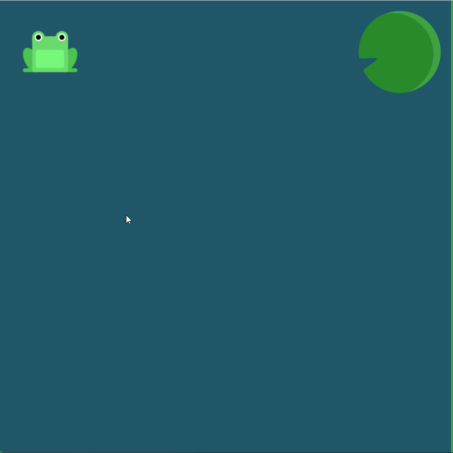

### CSS Flexbox: Полное руководство на примере игры с лягушками

<!-- 
  Это интерактивное руководство по CSS Flexbox.
  Каждый пример показывает, как различные свойства flexbox влияют на расположение элементов.
  Визуализация происходит на примере пруда с лягушками и кувшинками.
-->

<!-- 
  JUSTIFY-CONTENT: Выравнивание по основной оси (горизонтальной по умолчанию)
-->

<!-- Элементы прижаты к концу основной оси --> 
#### pond {
  display: flex; 
  justify-content: flex-end; 
}

<table>
  <tr>
    <td></td>
    <td></td>
  </tr>
</table>

<!-- Элементы выровнены по центру основной оси --> 
#### pond {
  display: flex; 
  justify-content: center; 
}

<table>
  <tr>
    <td></td>
    <td></td>
  </tr>
</table>

<!-- Равномерные отступы вокруг элементов; между элементами вдвое больше пространства, чем от краёв --> 
#### pond {
  display: flex; 
  justify-content: space-around; 
}

<table>
  <tr>
    <td></td>
    <td></td>
  </tr>
</table>
<!-- Равномерное распределение свободного пространства между элементами; первый и последний элементы прижаты к краям --> 

#### pond  {
  display: flex; 
  justify-content: space-between; 
}

<table>
  <tr>
    <td></td>
    <td></td>
  </tr>
</table>
<!-- 
  ALIGN-ITEMS: Выравнивание по поперечной оси (вертикальной по умолчанию)
-->

<!-- Элементы выравниваются по нижнему краю контейнера --> 
#### pond {
  display: flex; 
  align-items: flex-end; 
}

<table>
  <tr>
    <td></td>
    <td></td>
  </tr>
</table>
<!-- Комбинация: центрирование по обеим осям --> 

#### pond {
  display: flex; 
  justify-content: center; 
  align-items: center; 
}

<table>
  <tr>
    <td></td>
    <td></td>
  </tr>
</table>
<!-- Комбинация: space-around по основной оси и flex-end по поперечной --> 

#### pond  {
  display: flex; 
  justify-content: space-around; 
  align-items: flex-end; 
}

<table>
  <tr>
    <td></td>
    <td></td>
  </tr>
</table>
<!-- 
  FLEX-DIRECTION: Направление основной оси
-->

<!-- Элементы отображаются в обратном порядке к направлению текста --> 
#### pond {
  display: flex; 
  flex-direction: row-reverse; 
}

<table>
  <tr>
    <td></td>
    <td></td>
  </tr>
</table>
<!-- Элементы располагаются сверху вниз --> 

#### pond{
  display: flex; 
  flex-direction: column; 
}

<table>
  <tr>
    <td></td>
    <td></td>
  </tr>
</table>
<!-- Комбинация: row-reverse с выравниванием по левому краю --> 

#### pond {
  display: flex;
  flex-direction: row-reverse; 
  justify-content: left; 
}

<table>
  <tr>
    <td></td>
    <td></td>
  </tr>
</table>
<!-- Комбинация: column с выравниванием по концу основной оси --> 

#### pond {
  display: flex; 
  flex-direction: column; 
  justify-content: end; 
}

<table>
  <tr>
    <td></td>
    <td></td>
  </tr>
</table>
<!-- Комбинация: column-reverse с равномерным распределением пространства --> 

#### pond {
  display: flex; 
  flex-direction: column-reverse; 
  justify-content: space-between; 
}

<table>
  <tr>
    <td></td>
    <td></td>
  </tr>
</table>
<!-- Комбинация: row-reverse с центрированием и выравниванием по концу поперечной оси --> 

#### pond {
  display: flex; 
  flex-direction: row-reverse; 
  justify-content: center; 
  align-items: end; 
}

<table>
  <tr>
    <td></td>
    <td></td>
  </tr>
</table>
<!-- 
  ORDER: Изменение порядка отдельных элементов
  По умолчанию все элементы имеют order: 0
  Элементы с меньшим значением order располагаются раньше
--> 

#### pond {
  display: flex; 
} 
.yellow { 
  order: 2; 
}

<table>
  <tr>
    <td></td>
    <td></td>
  </tr>
</table> 

#### pond {
  display: flex; 
} 
.red { 
  order: -3; 
}

<table>
  <tr>
    <td></td>
    <td></td>
  </tr>
</table>
<!-- 
  ALIGN-SELF: Индивидуальное выравнивание отдельных элементов
  Переопределяет align-items для конкретного элемента
--> 

#### pond {
  display: flex; 
  align-items: flex-start; 
} 
.yellow { 
  align-self: end; 
}

<table>
  <tr>
    <td></td>
    <td></td>
  </tr>
</table>
<!-- Комбинация order и align-self для одного элемента --> 

#### pond {
  display: flex; 
  align-items: flex-start; 
} 
.yellow { 
  order: 2; 
  align-self: end; 
}

<table>
  <tr>
    <td></td>
    <td></td>
  </tr>
</table>
<!-- 
  FLEX-WRAP: Перенос элементов на новую строку
  По умолчанию flex-wrap: nowrap (все элементы в одну строку)
-->

<!-- Элементы автоматически переносятся на новую строку --> 

#### pond {
  display: flex; 
  flex-wrap: wrap; 
}

<table>
  <tr>
    <td></td>
    <td></td>
  </tr>
</table>
<!-- Комбинация column direction с wrap --> 

#### pond {
  display: flex; 
  flex-direction: column; 
  flex-wrap: wrap; 
}
<table>
  <tr>
    <td></td>
    <td></td>
  </tr>
</table>
<!-- 
  FLEX-FLOW: Сокращённая запись для flex-direction и flex-wrap
  Принимает два значения через пробел: направление и перенос
  
--> 
#### pond {
  display: flex; 
  flex-flow: column wrap; 
}

<table>
  <tr>
    <td></td>
    <td></td>
  </tr>
</table>
<!-- 
  ALIGN-CONTENT: Управление пространством между рядами (только при flex-wrap: wrap)
  Важно: align-content работает только когда элементов больше, чем помещается в одном ряду
  Когда только один ряд, align-content ни на что не влияет
  Это может запутать, но align-content отвечает за расстояние между рядами, 
  в то время как align-items отвечает за то, как элементы в целом будут выровнены в контейнере
--> 

#### pond {
  display: flex; 
  flex-wrap: wrap; 
  align-content: flex-start; 
}

<table>
  <tr>
    <td></td>
    <td></td>
  </tr>
</table> 

#### pond {
  display: flex; 
  flex-wrap: wrap; 
  align-content: flex-end; 
}

<table>
  <tr>
    <td></td>
    <td></td>
  </tr>
</table>
<!-- Комбинация column-reverse с центрированием содержимого --> 

#### pond {
  display: flex; 
  flex-wrap: wrap; 
  flex-direction: column-reverse; 
  align-content: center; 
}

<table>
  <tr>
    <td></td>
    <td></td>
  </tr>
</table>
<!-- 
  ФИНАЛЬНАЯ КОМБИНАЦИЯ: Все свойства вместе
  Сложный пример использования множества flexbox свойств
--> 

#### pond  {
  display: flex; 
  flex-flow: wrap-reverse; 
  align-content: space-between; 
  justify-content: center; 
  flex-direction: column-reverse; 
}
<table>
  <tr>
    <td></td>
    <td></td>
  </tr>
</table> 

  **Поздравляем! Вы освоили CSS Flexbox!** 
  Ты выиграл! Благодарим тебя за мастерство flexbox,  
  ты смог помочь всем лягушатам добраться до своих лилий.  
  **Просто взгляни, как они счастливы!** 

